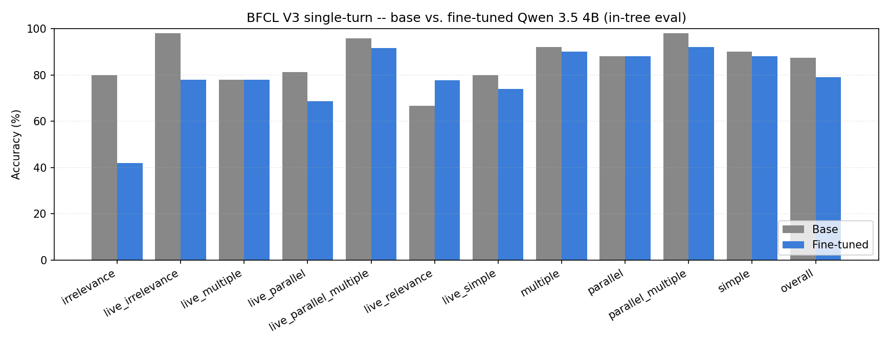

# tooltuned-qwen

A bf16 LoRA fine-tune of [`Qwen/Qwen3.5-4B`](https://huggingface.co/Qwen/Qwen3.5-4B) for tool / function calling. **v1.0 ships below the project's +3pp BFCL gate** with a full per-category disclosure of where and why it regresses; see [Honest analysis](#honest-analysis) and [ADR 0007](docs/decisions/0007-ship-v1.0-below-gate.md).

- **Adapter:** [huggingface.co/sukhrobnurali/tooltuned-qwen-3.5-4b](https://huggingface.co/sukhrobnurali/tooltuned-qwen-3.5-4b)
- **Training curves:** [wandb.ai/sukhrob-production/tooltuned-qwen](https://wandb.ai/sukhrob-production/tooltuned-qwen)
- **Decisions:** [docs/decisions/](docs/decisions/) (ADRs 0001 -- 0007)
- **Comparison artifacts:** [results/bfcl_intree/comparison/](results/bfcl_intree/comparison/)

---

## Headline numbers

In-tree BFCL V3 single-turn evaluator, 11 categories, 458 items total. Both arms run on Colab Pro A100.

| Arm | Overall | Items | Notes |
| --- | --- | --- | --- |
| Base `Qwen/Qwen3.5-4B` | **87.3%** | 400 / 458 | 768-token cap |
| Tuned (this adapter) | **79.0%** | 362 / 458 | 512-token cap |
| **Delta** | **-8.3pp** | -38 items | **Gate failed** -- target ≥ +3pp |

| Section | Categories | Items | Tuned delta |
| --- | --- | --- | --- |
| AST match | 8 | 290 | -11 items / -3.8pp |
| `must_call` (positive signal) | 1 (`live_relevance`) | 18 | **+2 items / +11.1pp** |
| `must_not_call` (negative signal) | 2 (`irrelevance` + `live_irrelevance`) | 100 | **-29 items / -29.0pp** |

The fine-tune learned the positive signal (calls correctly when tools are relevant) but lost the base model's ability to decline (over-calls when tools are unrelated). 76% of the regression sits in the two `must_not_call` categories. See [ADR 0006](docs/decisions/0006-eval-debugging.md) for the locked diagnosis.



---

## Motivation

A function-calling fine-tune of a 4B open model is a tight enough scope to ship end-to-end as a portfolio piece: small enough to train on a single A100 in under an hour, large enough that the methodology choices (dataset, eval, hyperparameters) actually move the number. The project closes the "talks about fine-tuning vs. demonstrates it" gap with a publicly reproducible artifact, full ADR trail, and an honest failure analysis.

The brief's headline target is in [03_tooltuned_qwen_brief.md](03_tooltuned_qwen_brief.md) §4.4: beat base by ≥3pp on BFCL. v1.0 missed it; the missing-it is documented, not hidden.

---

## Methodology

### Base model -- [ADR 0001](docs/decisions/0001-base-model.md)

`Qwen/Qwen3.5-4B`. Chosen for: native `<tool_call>` template, permissive Apache-2.0 license, sized to fit single-A100 LoRA training inside Colab Pro's budget, and the strongest open-weights option in the 3-7B "small enough to be cheap" band as of 2026-Q1.

### Training data -- [ADR 0003](docs/decisions/0003-dataset.md)

[`Salesforce/xlam-function-calling-60k`](https://huggingface.co/datasets/Salesforce/xlam-function-calling-60k). Compared head-to-head with `NousResearch/hermes-function-calling-v1` at 1 epoch / 1k samples; xLAM wins on schema alignment (no parser bridge needed) and lower training loss. The 0.5pp accuracy gap between the two datasets was within standard error on the ablation slice.

**Important property (and the v1.0 failure mode):** xLAM is positive-only by design -- every row pairs a user query with a function call. There is no `gold = "no call"` row anywhere in the 60k. The LoRA therefore learns a strong "the user wants a tool call" prior. This is the root cause of the `must_not_call` regression documented in [ADR 0006](docs/decisions/0006-eval-debugging.md). The mitigation (synth irrelevance mixin) is scoped but deferred -- see [Roadmap](#roadmap).

### Thinking-mode strategy -- [ADR 0004](docs/decisions/0004-thinking-mode.md)

`preserve`. Ablated against `strip` and `mix-75-25`; all three converged on the eval slice because xLAM rows have no `<think>` content -- the three strategies produce near-identical training samples. `preserve` matches Qwen 3.5's default and keeps inference-time flexibility. Inference-time finding: Qwen 3.5 reasons before emitting `<tool_call>`; `max_new_tokens` needs to be ≥ 512 (preferred 768) or the reasoning truncates mid-thought and the parser misses the call.

### Training configuration

| Knob | Value |
| --- | --- |
| Adapter format | bf16 LoRA (Unsloth advises against 4-bit quant for Qwen 3.5) |
| LoRA rank / alpha / dropout | 16 / 32 / 0.0 |
| Target modules | `q_proj`, `k_proj`, `v_proj`, `o_proj`, `gate_proj`, `up_proj`, `down_proj` |
| Optimizer | AdamW, lr 2e-4, warmup 0.03, weight decay 0.01 |
| Effective batch size | 16 (batch 4 × grad-accum 4) |
| Epochs / sequence length | 1 / 2,048 tokens |
| Samples | 10,000 xLAM rows |
| Hardware / time | Single A100 (40 GB), ~30 min wall time |

Trainer: [Unsloth](https://github.com/unslothai/unsloth) `FastLanguageModel` + TRL `SFTTrainer`. Adapter only; base weights frozen.

### Evaluation methodology -- [ADR 0005](docs/decisions/0005-eval-methodology.md)

**The evaluator is the load-bearing context for the v1.0 numbers.** Phase 4 began as a canonical [`bfcl-eval`](https://github.com/ShishirPatil/gorilla) CLI integration; six stacked upstream install blockers across `vllm` / `transformers` / `mistralai` / Qwen 3.5 / NCCL forced a pivot to an in-tree V3 single-turn evaluator. The in-tree path runs in the same Unsloth env that Phase 3 trained in, scoring 11 BFCL V3 categories totalling 458 items:

- **AST match (8 categories, 290 items):** `simple`, `multiple`, `parallel`, `parallel_multiple`, `live_simple`, `live_multiple`, `live_parallel`, `live_parallel_multiple`. AST-equality on `(function_name, kwargs)` pairs; lenient set-equality for the four `parallel*` categories.
- **`must_call` (1 category, 18 items):** `live_relevance`. Score 1 if the model emits any well-formed call, 0 otherwise.
- **`must_not_call` (2 categories, 100 items):** `irrelevance`, `live_irrelevance`. Score 1 if the model emits NO call, 0 otherwise.

The in-tree V3 evaluator gives a higher absolute base number (~87%) than the brief's stated BFCL V4 leaderboard baseline (~50%) because (a) V3 is single-turn-only and excludes the harder V4 multi-turn agentic categories, and (b) lenient parallel scoring rewards correct set membership rather than exact call order. The +3pp gate was anchored against the V4 leaderboard number when the brief was written; the recalibration miss is acknowledged in [ADR 0007](docs/decisions/0007-ship-v1.0-below-gate.md) §Context. The canonical CLI path is preserved at [src/tooltuned_qwen/eval/bfcl_runner.py](src/tooltuned_qwen/eval/bfcl_runner.py) for future revival.

---

## Results

Full per-category breakdown ([results/bfcl_intree/comparison/comparison.md](results/bfcl_intree/comparison/comparison.md)):

| Category | Base | Tuned | Delta | Scoring |
| --- | ---: | ---: | ---: | --- |
| `simple` | 90.0% | 88.0% | -2.0pp | AST |
| `multiple` | 92.0% | 90.0% | -2.0pp | AST |
| `parallel` | 88.0% | 88.0% | +0.0pp | AST (lenient) |
| `parallel_multiple` | 98.0% | 92.0% | -6.0pp | AST (lenient) |
| `live_simple` | 80.0% | 74.0% | -6.0pp | AST |
| `live_multiple` | 78.0% | 78.0% | +0.0pp | AST |
| `live_parallel` | 81.2% | 68.8% | -12.5pp | AST (lenient) |
| `live_parallel_multiple` | 95.8% | 91.7% | -4.2pp | AST (lenient) |
| **`irrelevance`** | **80.0%** | **42.0%** | **-38.0pp** | **must NOT call** |
| `live_relevance` | 66.7% | 77.8% | **+11.1pp** | must call |
| **`live_irrelevance`** | **98.0%** | **78.0%** | **-20.0pp** | **must NOT call** |
| **Overall** | **87.3%** | **79.0%** | **-8.3pp** | (micro) |

---

## Honest analysis

The fine-tune **did** work on the positive signal: `live_relevance` (must-call) gained +11.1pp / +2 items. The model correctly emits a call more often when tools are genuinely relevant.

But the fine-tune **destroyed** the base model's ability to decline. The two `must_not_call` categories lost 29 of the 38 regressed items (76% of the total damage). The base, with its broad pretraining mix, knew when not to call a function 80% / 98% of the time on `irrelevance` / `live_irrelevance`. The LoRA learned a stronger "always call" prior from xLAM's positive-only composition and over-calls when handed unrelated tools.

The eight AST categories regressed by only -11 items across 290 items (-3.8pp on AST-only), with no single category dropping more than -12.5pp on a 16-item slice -- consistent with mild format drift or minor xLAM-specific overfitting, not a structural failure. The AST half of the training succeeded. The eagerness is what costs us.

### Why the gate stays unmet, and why v1.0 ships anyway

The straightforward fix -- Phase 3.5 with a ~25% synthesised-irrelevance mixin -- is fully scoped in [ADR 0006](docs/decisions/0006-eval-debugging.md). Honest math projects best-case post-3.5 tuned overall at ~86% = -0.5pp delta. **Still under the +3pp gate.** Realistic post-3.5 outcome is ~-3pp delta.

Given that the gate was anchored against the V4 leaderboard's much harder base (~50%) and the in-tree V3 base lands at ~87%, the +3pp target on the V3 evaluator was structurally too ambitious -- a process miss documented in [ADR 0007](docs/decisions/0007-ship-v1.0-below-gate.md) §Context.

[ADR 0007](docs/decisions/0007-ship-v1.0-below-gate.md) records the decision: ship v1.0 below the gate with the disclosure on the public artifacts rather than burn another two sessions of Colab budget on a retrain that wouldn't clear the gate either. The brief is **not** amended -- the +3pp gate stands as the original design intent. The portfolio value of an honest failure analysis was judged higher than the marginal value of a +1 training run.

---

## Lessons learned

Five things this project carries forward, written so they're useful to someone fine-tuning a small model on a positive-only dataset for a category-mixed eval:

1. **Calibrate the gate against the evaluator before training.** ADR 0001 anchored +3pp on top of the brief's BFCL V4 baseline (~50%). When Phase 4 pivoted to an in-tree V3 evaluator that produced base ~87%, the threshold should have been re-anchored. *Rule: if the eval pipeline changes, recalibrate the success criterion before continuing.*

2. **Positive-only datasets create over-call bias on `must_not_call` evals.** Obvious in hindsight; not obvious before the per-category breakdown made it visible. *Rule: if the dataset has no negatives for a decision-to-act category, the model will learn to always act.*

3. **Measure the base before designing the gate.** A 10-minute base eval at Phase 0 would have flipped the entire project's framing -- the gate would have been "match base within X" rather than "beat base by Y." The brief's gate was set before Phase 1; the base measurement landed at Phase 4 cell 3.

4. **Per-category eval >> overall-only eval.** The headline -8.3pp number looks like the LoRA is broken. The per-category breakdown reveals it's a clean over-call story concentrated in two categories, with positive signal preserved on `live_relevance`. A reviewer can act on the second analysis; the first is just bad news.

5. **Document evaluator limitations as load-bearing context, not footnotes.** ADR 0005 records the V3-vs-V4 substitution, the lenient parallel-category scoring, and the in-tree-vs-canonical pivot. Without those, the v1.0 numbers are uninterpretable and the failure looks like a code bug.

---

## Reproducibility

The repo is reproducible in two pieces: training (Colab Pro A100, GPU-bound) and tooling (local laptop, CPU-bound).

### Local tooling (no GPU)

```bash
git clone https://github.com/sukhrobnurali/tooltuned-qwen
cd tooltuned-qwen
uv sync
uv run pytest         # 95+ tests pass on Python 3.12
uv run ruff check .
```

`pyproject.toml` + `uv.lock` are the reproducibility contract; the `[colab]` extra carries the GPU dependencies (Unsloth, TRL, vLLM peers) so the local dev install stays small.

### Training + evaluation (Colab Pro A100)

- **Training:** [notebooks/colab_main.ipynb](notebooks/colab_main.ipynb) -- end-to-end Phase 3 training run.
- **In-tree evaluation:** [notebooks/colab_bfcl_intree.ipynb](notebooks/colab_bfcl_intree.ipynb) -- the V3 in-tree evaluator that produced the v1.0 numbers. 5 cells, ~1.5h on A100 at default `n_per_cat=50`.
- **Canonical CLI evaluation (deferred):** [notebooks/colab_bfcl.ipynb](notebooks/colab_bfcl.ipynb) -- not runnable as-is until the vllm / transformers / Qwen 3.5 / NCCL install matrix stabilises (see [ADR 0005](docs/decisions/0005-eval-methodology.md)).

The published artifacts under [results/bfcl_intree/](results/bfcl_intree/) are the literal JSONs the notebook produced, committed alongside the code.

### Adapter loading (inference)

```python
from unsloth import FastLanguageModel

model, tokenizer = FastLanguageModel.from_pretrained(
    model_name="sukhrobnurali/tooltuned-qwen-3.5-4b",
    max_seq_length=2048,
    dtype=None,
    load_in_4bit=False,  # bf16 LoRA -- 4-bit harms Qwen 3.5 per Unsloth guidance
)
FastLanguageModel.for_inference(model)
# ... apply Qwen 3.5 chat template with tool schemas, sample with max_new_tokens >= 512.
```

---

## What is NOT in v1.0

These are roadmap items, not bugs:

- **Phase 3.5 (irrelevance-mixin retrain).** Scoped in [ADR 0006](docs/decisions/0006-eval-debugging.md). Honest math suggests it would land at ~-0.5pp delta -- still under the gate -- so it's deferred rather than scheduled.
- **Canonical `bfcl-eval` CLI on Colab.** Code is preserved at [src/tooltuned_qwen/eval/bfcl_runner.py](src/tooltuned_qwen/eval/bfcl_runner.py); the notebook entry point is [notebooks/colab_bfcl.ipynb](notebooks/colab_bfcl.ipynb). Revives when the upstream install matrix stabilises.
- **BFCL leaderboard PR.** Only meaningful once a future re-train clears the gate, since the leaderboard expects pass-rate improvements over the same baseline.
- **Merged-weights export + GGUF quantisation for `ollama` / `llama.cpp`.** Convenience artifacts; can ship as v1.1.

---

## Repository layout

```
.
├── 03_tooltuned_qwen_brief.md          # original project brief (source of truth)
├── CHANGELOG.md                        # version history
├── CITATION.cff                        # GitHub-recognised citation metadata
├── LICENSE                             # Apache-2.0
├── README.md                           # this file
├── configs/
│   └── default.yaml                    # locked training config (Phase 3)
├── docs/decisions/                     # ADRs 0001 -- 0007
├── notebooks/
│   ├── colab_main.ipynb                # Phase 3 training
│   ├── colab_bfcl_intree.ipynb         # Phase 4 in-tree eval
│   └── colab_bfcl.ipynb                # canonical CLI eval (deferred)
├── results/bfcl_intree/
│   ├── base/results.json               # Qwen 3.5 4B base, 458 items
│   ├── tuned/results.json              # adapter, 458 items
│   └── comparison/                     # bfcl_results.json + comparison.md + bfcl_comparison.png
├── scripts/                            # one-shot maintenance scripts
├── src/tooltuned_qwen/
│   ├── data/                           # xLAM loader + chat-template apply
│   ├── eval/                           # in-tree V3 + canonical CLI wrapper + compare
│   ├── hub/                            # model_card generator
│   ├── inference/                      # tokenizer, chat template, tool-call parser
│   └── training/                       # config schema + LoRA trainer wrapper
└── tests/                              # 95+ pytest unit tests
```

---

## Roadmap

See [CHANGELOG.md](CHANGELOG.md) `[Unreleased]` section. Short version: Phase 3.5, canonical CLI revival, Phase 5 (merged weights / GGUF), BFCL leaderboard PR -- all deferred, all documented with concrete entry points so a future contributor (or future-me) can pick them up.

---

## References

- **Brief:** [03_tooltuned_qwen_brief.md](03_tooltuned_qwen_brief.md)
- **Decisions:**
  - [ADR 0001](docs/decisions/0001-base-model.md) -- Qwen 3.5 4B + original +3pp gate
  - [ADR 0002](docs/decisions/0002-pinned-versions.md) -- pinned dependency versions
  - [ADR 0003](docs/decisions/0003-dataset.md) -- xLAM over Hermes
  - [ADR 0004](docs/decisions/0004-thinking-mode.md) -- preserve thinking mode
  - [ADR 0005](docs/decisions/0005-eval-methodology.md) -- in-tree V3 eval pivot
  - [ADR 0006](docs/decisions/0006-eval-debugging.md) -- diagnosis (over-call on irrelevance)
  - [ADR 0007](docs/decisions/0007-ship-v1.0-below-gate.md) -- ship below gate with disclosure
- **Model:** [sukhrobnurali/tooltuned-qwen-3.5-4b](https://huggingface.co/sukhrobnurali/tooltuned-qwen-3.5-4b)
- **Dataset:** [Salesforce/xlam-function-calling-60k](https://huggingface.co/datasets/Salesforce/xlam-function-calling-60k)
- **Base model:** [Qwen/Qwen3.5-4B](https://huggingface.co/Qwen/Qwen3.5-4B)
- **Training curves:** [wandb.ai/sukhrob-production/tooltuned-qwen](https://wandb.ai/sukhrob-production/tooltuned-qwen)
- **Eval framework:** [BFCL / Gorilla](https://github.com/ShishirPatil/gorilla)

---

## License

Apache-2.0 -- see [LICENSE](LICENSE). Same license as the base model.

## Citation

`CITATION.cff` is the machine-readable metadata; GitHub renders a "Cite this repository" button from it. A BibTeX form for papers / blog posts:

```bibtex
@misc{nurali_tooltuned_qwen_2026,
  author       = {Sukhrob Nurali},
  title        = {tooltuned-qwen-3.5-4b: a tool-calling LoRA for Qwen 3.5 4B},
  year         = {2026},
  howpublished = {\url{https://huggingface.co/sukhrobnurali/tooltuned-qwen-3.5-4b}}
}
```
